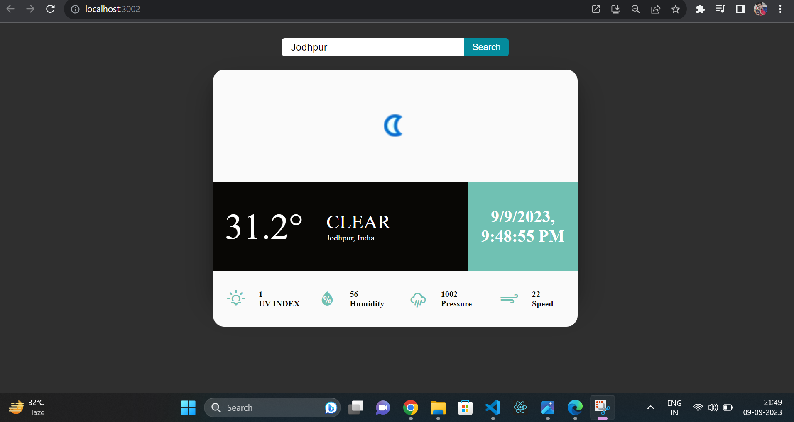

# Weather Application



## Description

The Weather Application is a React-based web application that allows users to retrieve weather information for any city in the world. It leverages the OpenWeather API to provide accurate and up-to-date weather data. This application is designed to be user-friendly, informative, and capable of handling errors gracefully.

## Features

- **City-based Weather Retrieval:** Users can enter the name of any city in the world to get the current weather conditions. The application fetches data from the OpenWeather API and displays it in a user-friendly format.

- **Detailed Weather Information:** The application provides a range of weather information, including temperature, humidity, wind speed, and weather conditions (e.g., rain, snow, clear skies). Users can quickly glance at the weather summary for their chosen location.

- **Error Handling:** The application includes robust error handling to provide a smooth user experience. If a user enters an incorrect city name or encounters any other issues during data retrieval, informative error messages are displayed to guide the user.

- **Responsive Design:** The Weather Application is built with a responsive design, ensuring that it looks and works well on various devices, including desktops, tablets, and smartphones.

## Technologies Used

- **React:** The front-end of the application is built using the React library, providing a dynamic and responsive user interface.

- **OpenWeather API:** The application fetches weather data from the OpenWeather API, which provides reliable and up-to-date weather information.

- **Error Handling:** Comprehensive error handling is implemented using React state and conditional rendering to gracefully manage user input errors and API-related issues.

- **CSS:** Custom CSS styles are used for layout and design, creating an attractive and user-friendly interface.

## Getting Started

To run this project locally, follow these steps:

1. Clone the repository to your local machine:

   ```bash
   git clone https://github.com/viralkansarav/weather-app
   cd weather-app
   npm install
   npm start
   Open your web browser and visit http://localhost:3000 to use the Weather Application.
   Usage
   Enter the name of the city you want to check the weather for in the input field.
   ```

Click the "search" button.

If the city name is valid, you will see the weather information displayed on the screen.

If there is an issue with the city name or the API, you will receive an error message indicating what went wrong.

Contributing
Contributions are welcome! If you'd like to contribute to this project, please follow these steps:

Fork the repository.

Create a new branch for your feature or bug fix.

Make your changes and commit them with descriptive commit messages.

Push your changes to your forked repository.

Create a pull request to merge your changes into the main project.

License
This project is licensed under the MIT License - see the LICENSE.md file for details.
